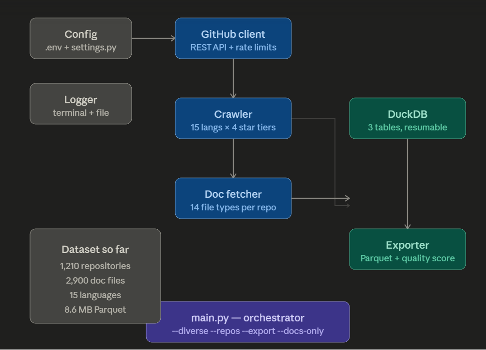

<!-- HERO BANNER -->
<p align="center">
  
</p>

<!-- FANCY BADGES -->
<p align="center">
  
  
  
  
  
  
</p>

<!-- NAVIGATION BUTTONS -->
<p align="center">
  <a href="#-overview">
    
  </a>
  <a href="#%EF%B8%8F-architecture">
    
  </a>
  <a href="#-dataset-preview">
    
  </a>
  <a href="#-quick-start">
    
  </a>
  <a href="#-schema-specifications">
    
  </a>
  <a href="#-license">
    
  </a>
</p>

---

## 📖 Overview

A curated, highly structured dataset of **1,200+ open-source GitHub repositories** spanning **15 programming languages**, systematically processed for AI research, Large Language Model (LLM) fine-tuning, NLP applications, and empirical software engineering studies.

### 💡 Why this dataset?
Existing technical datasets primarily aggregate raw source code. This dataset targets the rarer, highly semantic **documentation layer** of open-source software—the files intentionally written by developers to abstract, explain, and contextualize their work. It is exceptionally optimized for:
* **Retrieval-Augmented Generation (RAG)** frameworks
* **LLM Context Window Training** & Documentation Q&A
* **AI Coding Agents** & Repository recommendation systems

---

## 📊 Project Statistics

<p align="center">
  <table>
    <thead>
      <tr style="background-color: #1f425f;">
        <th>📦 Repositories</th>
        <th>💻 Languages</th>
        <th>📄 Documentation Files</th>
        <th>⚡ Export Format</th>
      </tr>
    </thead>
    <tbody>
      <tr>
        <td align="center"><b>1,210+</b></td>
        <td align="center"><b>15</b></td>
        <td align="center"><b>2,900+</b></td>
        <td align="center"><b>Parquet (ZSTD Compressed)</b></td>
      </tr>
    </tbody>
  </table>
</p>

━━━━━━━━━━━━━━━━━━━━━━━━━━━━━━━━━━━━━━━━━━━━━━━━━━━━━━━━━━━━━
* 📦 **1,210** Tracked Repositories
* 📄 **2,900+** Decoded Documentation Files
* 💻 **15** Programming Languages Covered
* ⭐ Automated Structural **README Quality Scoring**
* 🦆 Powered via **DuckDB** Relational Engine
* ⚡ Optimized **Parquet Exports** (~8.6 MB Total)
━━━━━━━━━━━━━━━━━━━━━━━━━━━━━━━━━━━━━━━━━━━━━━━━━━━━━━━━━━━━━

---

## ✨ Features

* 🕷️ **Multi-Tier Crawler:** Balanced discovery across star segments to eliminate ecosystem popularity bias.
* 📚 **Contextual Collector:** Automatically targets `README`, `LICENSE`, `CONTRIBUTING`, `CHANGELOG`, `SECURITY`, `CODE_OF_CONDUCT`, and core dependency manifests (`requirements.txt`, `package.json`, `Cargo.toml`).
* 📊 **Calibrated Scorer:** Assigns a 0–100 structural quality score to READMEs based on depth, headers, code block density, and mandatory sections.
* 🦆 **DuckDB Storage:** Implements an interim relational database strategy featuring fully resumable pipeline states.
* ⚡ **Performance Optimized:** Rate-limit aware pipeline utilizing asynchronous, jittered requests over the GitHub REST API.

---

## 🏗️ Architecture

The framework operates via fully decoupled modules processing analytical state transformations cleanly.

<p align="center">
  
</p>

### 🔁 Pipeline Execution Flow
```mermaid
flowchart LR
    A[GitHub API] --> B[Crawler]
    B --> C[Doc Fetcher]
    C --> D[DuckDB Storage]
    D --> E[Exporter]
    E --> F[Parquet Dataset]
    
    style A fill:#2b579a,stroke:#333,stroke-width:2px,color:#fff
    style D fill:#00a300,stroke:#333,stroke-width:2px,color:#fff
    style F fill:#7e51a5,stroke:#333,stroke-width:2px,color:#fff
📂 Project Structure
Plaintext
github-documentation-dataset/
├── config/                  # Configuration mappings & environment bindings
├── crawler/                 # Language iteration & repository tier selectors
├── database/                # DuckDB connector and local session handling
├── exporter/                # Parquet compilation and ZSTD file compressors
├── github/                  # Core REST API client handling throttling & authentication
├── scoring/                 # README rubric evaluation engine
├── assets/
│   └── image_98e12a.png     # Pipeline layout schema visualization
├── repositories.parquet     # Repository parent records metadata (~0.2 MB)
├── documentation.parquet    # Raw text content & quality index metrics (~8.4 MB)
└── summary_stats.parquet    # Aggregated language trend data (<0.1 MB)
📊 Dataset Preview
Distribution Trend
Plaintext
Python        ████████████████████ 14%
JavaScript    ██████████████████   12%
TypeScript    █████████████████    11%
Go            ████████████         8%
Rust          ██████████           7%
Other (10)    ████████████████████ 48%
Mock Snapshots
Repository Full Name	Primary Language	Star Metrics	README Quality Score
pytorch/pytorch	Python	95k+	98
facebook/react	JavaScript	230k+	100
duckdb/duckdb	C++	35k+	96
🚀 Quick Start
Ensure you have Python 3.10+ and a GitHub Personal Access Token ready.

1. Environment Setup
Bash
git clone [https://github.com/vansh-kumar-007/github-dataset.git](https://github.com/vansh-kumar-007/github-dataset.git)
cd github-dataset

python -m venv venv
source venv/bin/activate  # On Windows: venv\Scripts\activate
pip install -r requirements.txt
2. Configuration Configuration
Copy .env.example to .env and assign your authentication tokens:

Code snippet
GITHUB_TOKEN=your_token_here
MAX_REPOS=1000
REQUEST_DELAY=1.5
3. Running Pipeline Orchestration
Bash
# Execute multi-tier repository & documentation discovery
python main.py --diverse --repos 1000

# Compile staging files into final Parquet storage
python main.py --export
🔍 Example Analysis (DuckDB Code snippets)
Python
import duckdb
conn = duckdb.connect()

print("--- 1. TOP PYTHON PROJECTS ---")
print(conn.execute("""
    SELECT name, owner, stars, license 
    FROM read_parquet('repositories.parquet')
    WHERE language = 'Python' ORDER BY stars DESC LIMIT 5
""").df())

print("\n--- 2. HIGHEST QUALITY READMES ---")
print(conn.execute("""
    SELECT r.full_name, r.language, d.readme_quality_score
    FROM read_parquet('repositories.parquet') r
    JOIN read_parquet('documentation.parquet') d ON r.full_name = d.repo_full_name
    WHERE d.file_name = 'README.md'
    ORDER BY d.readme_quality_score DESC LIMIT 5
""").df())
📋 Schema Specifications
Field	Type	Description
id	integer	Unique GitHub repository identification key
name	string	Base name of the target repository
owner	string	Profile username or institutional organization handling the project
full_name	string	Structured owner/name unique format
description	string	Readme/head description metadata text provided by creators
stars	integer	Chronological total star counts measured at extraction
forks	integer	Public forks network tally metrics
language	string	Primary computational development language detected by system
license	string	Upstream licensing policy tag
created_at	string	Raw timestamp showing project generation dates
updated_at	string	Core parameter tracking internal push events updates
topics	string	Flattened array strings mapping user-provided topic classifications
archived	boolean	Boolean evaluating development lifecycle activity tracking
repo_url	string	Explicit direct URL routing to source repositories
has_readme	boolean	Binary evaluator checking text layout setups
Field	Type	Description
repo_full_name	string	Foreign key referencing master entity relational setups
file_name	string	Concrete target identifier metadata item (e.g., README.md, LICENSE)
content	string	Untruncated text block decoded from target file trees
file_size	integer	File weights compiled in byte numbers
readme_quality_score	integer	Assigned analytical metric scaling from 0-100 (README exclusive)
📊 Language Coverage & Star Stratification
The dataset employs strict tier bucketing strategies to extract highly balanced textual models across variable popularity ranges:

Tier	Star Range	Operational Context Profile Target
Emerging	50–200	Small, agile implementations, community utilities
Established	200–1,000	Production tools with definitive operational usage histories
Popular	1,000–5,000	Highly reliable libraries and foundational systems
Very Popular	5,000–50,000	Major ecosystem definitions dominating the workspace
Covered Languages: Python, JavaScript, TypeScript, Java, Go, Rust, C++, C, Ruby, PHP, Swift, Kotlin, Shell, HTML, CSS.

⚖️ README Quality Scoring Rubric
Scores are computed programmatically out of 100 via the internal heuristic scoring engine:

Length (20 pts): Evaluated smoothly using continuous logistics to remove artificial boundaries.

Structural Formats (15 pts): Calculated using Markdown typographic heading distributions (H 
1
​
 ,H 
2
​
 ,H 
3
​
 ).

Practical Code-density (20 pts): Validated by tracking code fence code segment densities (‘‘‘).

Completeness Sections (25 pts): Token testing for sections tracking Installation, Usage, Contributing, or License.

Hyperlink Network (10 pts): Evaluation metrics summarizing reference links and media components.

Ecosystem Badges (5 pts): Looks for active continuous integration badges, deployment logs, or project updates.

🚀 Roadmap
[x] Resumable DuckDB operational data tier

[x] Document parsing engine (v2 calibrated scoring)

[x] Parquet ZSTD optimization exporter script

[ ] Implement Incremental updates and API delta caching

[ ] Migrate extraction engines over to GitHub GraphQL protocols

[ ] Native Hugging Face Dataset format repository mirrors

[ ] Generate standard vector embedding projections over documentation fields

⚠️ Limitations & Ethics
Compliance: Operations use official endpoints adhering directly to GitHub Terms of Service.

Licensing Responsibilities: Upstream texts maintain original developer authorship properties. Downstream pipeline users carry the absolute duty to verify specific open-source licensing compliance limits before training deep networks or commercial applications.

State Drift: Structural features represent static historical moments logged at download times and will show natural drift over time.

📜 License
The pipeline implementation and automation tools are provided under the MIT License.

Tabular items collected are property of original project authors explicitly indexed in their respective license tracking fields.

🎓 Citation
Code snippet
@dataset{github_documentation_dataset_2026,
  author    = {Kumar, Vansh},
  title     = {GitHub Documentation Dataset},
  year      = {2026},
  publisher = {Kaggle},
  url       = {https://kaggle.com/datasets/vansh-kumar-007/github-documentation-dataset}
}
🔄 Changelog
v1.0.0 — June 2026
Initial public release containing 1,210 curated repository entries.

Indexed 2,900+ documentation elements wrapped cleanly inside compressed columnar Parquet blocks.

Integrated the calibrated v2 heuristic metadata quality score metrics.